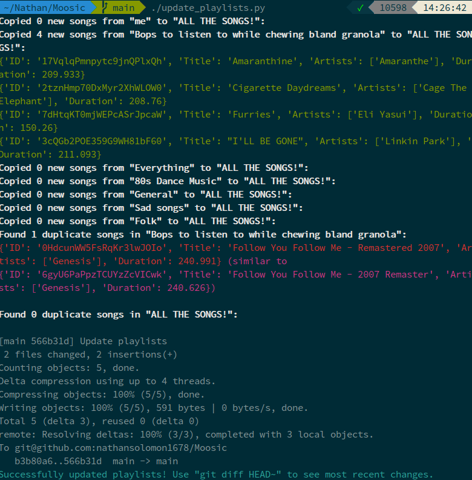

# Moosic

## Contains various utilities to:

* Version control spotify playlists (to avoid accidentally deleting songs)
* Copy feeder playlists into a main playlist (e.g. a family playlist)

## To setup this repository:

* Fork the repo & clone your fork to your computer
* Read the code and figure out what it does & how to use it
* Create the JSON file with necessary info
* Create an executable script in `/etc/cron.daily` to run `./update_playlists.py`
* Replace all playlist URLs and stuff in the code to suit your needs
* Debug, because it sure ain't gonna work the first time

Example usage:

## You think I'm paranoid, BUT...
This repository actually has saved me before. If I wasn't version-controlling my playlists, I might have permanently forgotten about Cascada's "Everytime we touch", but looking at the git diff spared me from that fate.

## My playlists
See all my playlists [here](https://github.com/nathansolomon1678/Moosic/tree/main/playlists) or [follow me on Spotify](https://open.spotify.com/user/1knaig961apydoe6jjdhwyiq6).
